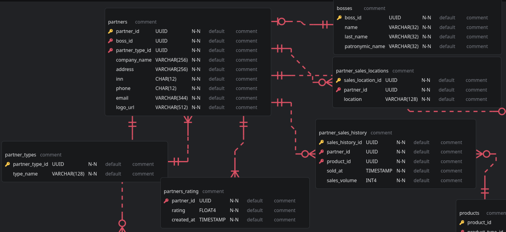
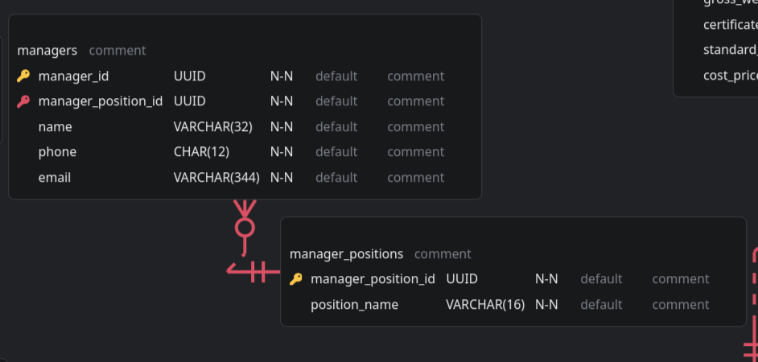
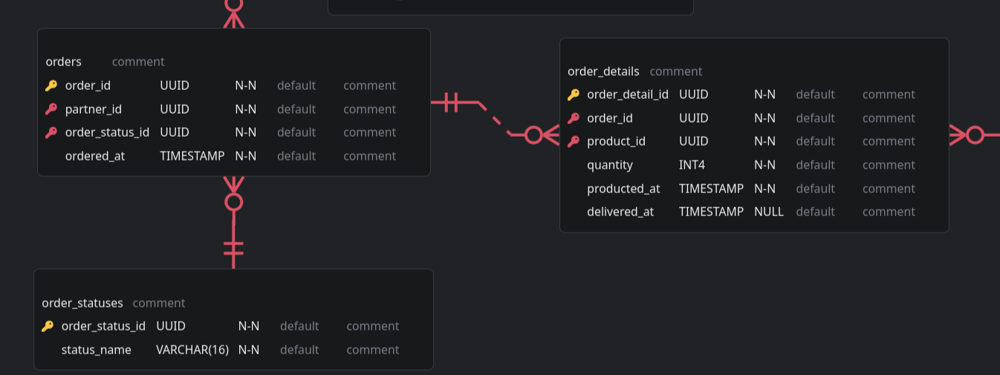
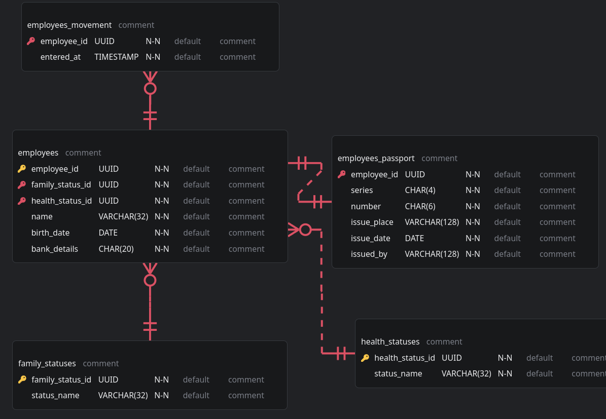
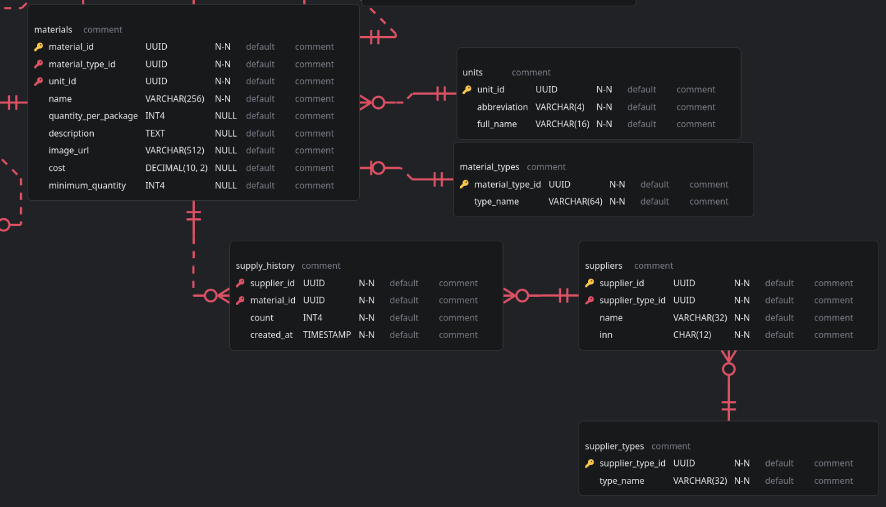
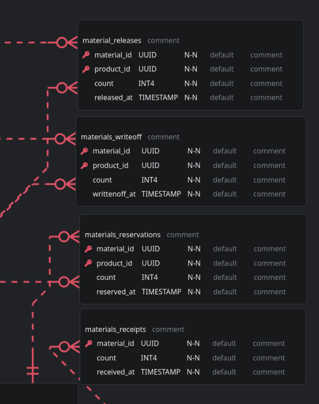
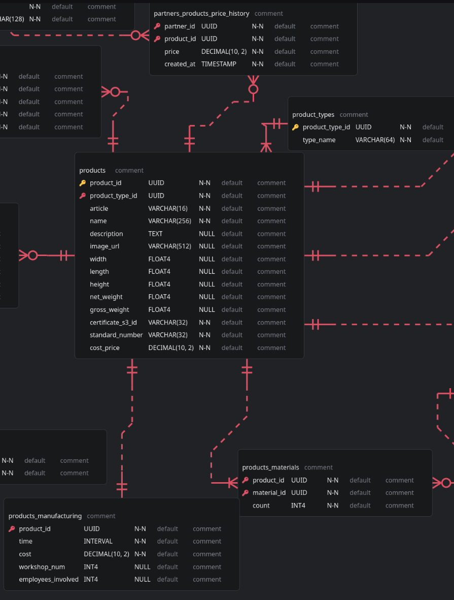

# SQL запросы

PL/pgSQL в файле create_tables.sql

# Исходная схема

Находится в файле docs/database.erd, может быть просмотрена в VSCode с расширением ERD Editor.

# Состовляющие области
## Партнёры

## Менеджеры

## Заказы

## Сотрудники, кадры, доступ

## Материалы, поставщики

## Склад, поставщики

## Продукция
